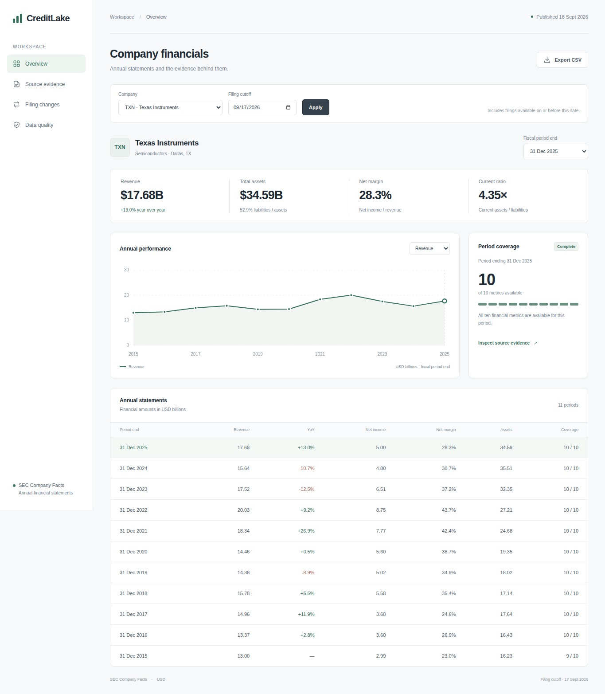
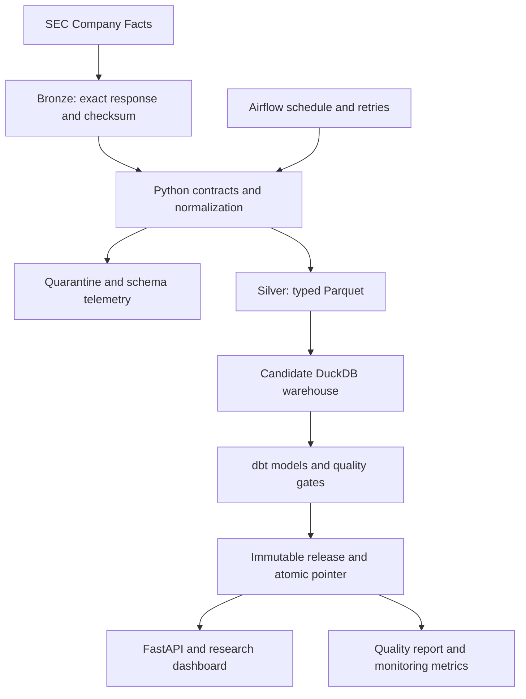

# CreditLake

**Versioned SEC financial data, reproducible analytics, and safe pipeline recovery.**

[](https://github.com/sreemaanshivkirth05/creditlake-financial-data-platform/actions/workflows/ci.yml)

CreditLake turns real SEC Company Facts JSON into versioned Parquet, a DuckDB
warehouse, tested dbt marts, and a read-only financial research dashboard.
The bundled dataset covers eight Dallas/Fort Worth issuers. The engineering
focus is reproducibility, revised filing values, historical cutoffs, provenance,
and safe publication when a pipeline fails.



Validated locally: **10,738 financial fact versions · 89 annual periods ·
23 passing dbt checks · 39 passing Python tests · two successful Airflow tasks**. Python test results and
the reproducible recovery verification are in [validation evidence](docs/VALIDATION.md).

## The problem this solves

An analyst comparing historical company financials needs more than the latest
number. Later filings can change earlier periods, quarterly amounts can be
mistaken for annual totals, and a partially failed refresh can leave a dashboard
with inconsistent tables. CreditLake preserves filing evidence, applies explicit
period and cutoff rules, and publishes a new warehouse only after its quality
checks pass.

The research workspace supports annual comparisons, margins, liquidity ratios,
historical filing-date views, and inspection of changed reported values. It covers
Texas Instruments, AT&T, Southwest, CBRE, Copart, D.R. Horton, Wingstop, and Brinker.

## Workspace

The dashboard provides four views: annual financials, source evidence, changed
filing values, and published-release data quality. Company and filing-cutoff
filters control financial history. Fiscal-period selection updates the summary,
chart, coverage, and source records together. CSV exports include the selected
filing cutoff and preserve the source monetary values as decimal strings.

Download [the self-contained preview](demo/CreditLake_Demo.html) and open it in a
browser, or run the API for original-source archive and full provenance downloads.
The preview uses captured data; it does not fetch current SEC responses.

## Architecture



| Component | Responsibility |
|---|---|
| Python | SEC acquisition, validation, deterministic identities, and release coordination |
| Parquet | Typed compressed financial observations and portable exports |
| DuckDB | Transactional raw loading and analytical SQL on a single machine |
| dbt | Six dependency-managed models, financial selection rules, and 23 quality checks |
| Airflow | Scheduled execution, retries, timeouts, and independent release verification |
| FastAPI | Read-only analytics, original source downloads, metric lineage, and coverage reports |
| GitHub Actions | Behavioral tests, Python version matrix, and Docker serving checks |

## Run locally

Python 3.11–3.13 is required. Run these commands from the unpacked project folder.

```bash
python -m venv .venv
# macOS/Linux:
source .venv/bin/activate
# Windows PowerShell instead:
# .venv\Scripts\Activate.ps1
python -m pip install -e '.[dev]'
creditlake run --as-of 2026-09-17
creditlake serve
```

Open http://127.0.0.1:8000 for the dashboard and http://127.0.0.1:8000/docs for
the API. The default run uses real, captured SEC responses, works without network
access after installation, and needs no credentials. `demo/CreditLake_Demo.html`
is a standalone preview that opens without Python.

For the exact validated dependency versions, install with
`python -m pip install -c requirements.lock.txt -e '.[dev]'`.

On systems with Make, `make install run serve` performs the same setup after
activating your environment. PowerShell users can run the Python commands directly.

## Capabilities

- Incremental snapshot ingestion with SHA-256 checkpoints and deterministic fact IDs.
- Immutable compressed bronze sources and typed, compressed silver Parquet.
- Filing revisions retained independently of the latest-value analytical view.
- SCD Type 2 issuer attributes and a financial star schema at actual period-end grain.
- dbt transformations, relationship tests, uniqueness tests, and financial contract checks.
- Quarantine, schema drift telemetry, structured run reports, and recovery verification.
- Atomic release publication: readers keep using the previous validated warehouse until the next one passes.
- A parameterized read-only API with filing-date and platform observation-time cutoffs.
- A metric lineage endpoint linking each immutable fact to its source, Parquet partition, and warehouse record.
- Financial coverage reporting with named missing fields and balance-equation warnings.
- Prometheus-compatible release metrics, distinguishing publication age from source freshness.
- Airflow scheduling integration, Docker packaging, and GitHub Actions verification.

## Audit one real number

After starting the API, request:

```text
GET /api/companies/TXN/facts?period_end=2023-12-31
GET /api/facts/{fact_id}/lineage
GET /api/facts/{fact_id}/source
GET /api/quality
GET /metrics
```

Copy an actual `fact_id` from the first response into the next two requests.
The lineage response identifies the SEC filing, original response SHA-256,
bronze archive, silver partition, raw record, and annual model path. Downloading
the source independently verifies its checksum. API monetary values remain exact
decimal strings. Open `/docs` to use these endpoints interactively.

`creditlake quality` explains missing metrics by issuer and period. The
[coverage report](sample_outputs/quality_report.json) records 35 complete and
54 incomplete annual periods under the ten-metric contract. Missing fields stay
null, and descriptive review flags are not credit ratings.

## Live source refresh

Use your own real contact address in the SEC User-Agent:

```bash
export SEC_USER_AGENT='YourProject your.name@example.com'
creditlake run --mode live
```

PowerShell uses `$env:SEC_USER_AGENT = 'YourProject your.name@example.com'`.
Requests run serially, are throttled to fewer than two per second, and retry
transient errors. No paid API key is needed. Source documentation:
[SEC EDGAR APIs](https://www.sec.gov/search-filings/edgar-application-programming-interfaces)
and [SEC developer resources](https://www.sec.gov/about/developer-resources).

## Verify behavior

```bash
pytest
ruff check .
creditlake run                # unchanged snapshots are skipped
creditlake run --force --fail-at before_publish
creditlake status             # the previous release is still serving
creditlake run --force        # rebuild and publish successfully
```

For isolated verification without changing the serving database:

```bash
python scripts/verify_pipeline.py
```

This command uses the captured real dataset, injects a publication failure,
verifies that the original release still serves, recovers, and checks that the
old release remains readable. Verification completes without API credentials.

## Container setup

```bash
docker compose up --build --wait api
python scripts/container_smoke.py
docker compose down
```

The API binds to localhost. The optional Airflow development service is enabled
with `docker compose --profile airflow up --build airflow`; its DAG starts paused.
The Docker build and Compose serving smoke check run in GitHub Actions alongside
the Python 3.11, 3.12, and 3.13 test matrix. See [validation](docs/VALIDATION.md).

## Performance and scaling

The captured eight-issuer pipeline completed in 7.125 seconds in the original
local validation run. A separate generated-data benchmark verifies row count
and exact monetary sum while measuring normalization, Parquet writing, and raw
loading. It excludes network access, dbt, serving, and cloud execution.

The larger [500,000-row synthetic run](docs/evidence/benchmark-500k.json)
completed those measured stages in 13.765 seconds locally, with an independently
verified row count and monetary sum. This is a generated-data result, not a claim
that the project processes 500,000 real issuer facts or runs on distributed infrastructure.

```bash
python scripts/benchmark.py --rows 100000 --output docs/evidence/benchmark.json
```

Raw ingestion is incremental; analytical marts rebuild after changes. Writers
are serialized and readers use immutable releases. The [scaling plan](docs/ROADMAP.md)
explains when affected-period recomputation, a shared warehouse, and a cloud
transactional catalog would become appropriate.

## Project structure

```text
src/creditlake/   ingestion, normalization, releases, analytics, API, dashboard
dbt/             source contracts, SQL models, macros, quality tests
fixtures/sec/    actual SEC responses and integrity/source manifest
tests/           replay, revisions, SCD, recovery, API and integration tests
dags/            Airflow scheduled pipeline
scripts/         source capture, standalone demo export, benchmark
docs/            architecture, contracts, operations, quality, validation
demo/            shareable dashboard preview
```

## Scope

CreditLake runs on a single machine, with measured local and CI
validation. It does not claim a cloud deployment, distributed scale, or production
use by a financial institution. Annual ratios use whole-entity USD facts from
10-K/10-K/A filings. Missing metrics stay null; review flags are descriptive
rules rather than credit ratings. Fiscal year ends differ between companies.
Revised reported values may be reclassifications rather than formal restatements.

The software is MIT licensed. Public SEC source data retains its original
provenance; issuer names and marks belong to their respective owners.

## Documentation

| Document | Content |
|---|---|
| [Architecture](docs/ARCHITECTURE.md) | Storage, temporal semantics, publication, and design tradeoffs |
| [Data contract](docs/DATA_CONTRACT.md) | Fact grain, concept mapping, and annual selection rules |
| [Operations](docs/RUNBOOK.md) | Installation, execution, recovery, monitoring, and containers |
| [Data quality](docs/DATA_QUALITY.md) | Coverage findings and balance-warning investigation |
| [Validation](docs/VALIDATION.md) | Measured results, reproducible checks, and execution boundaries |
| [Roadmap](docs/ROADMAP.md) | Incremental modeling, infrastructure, and operational extensions |
