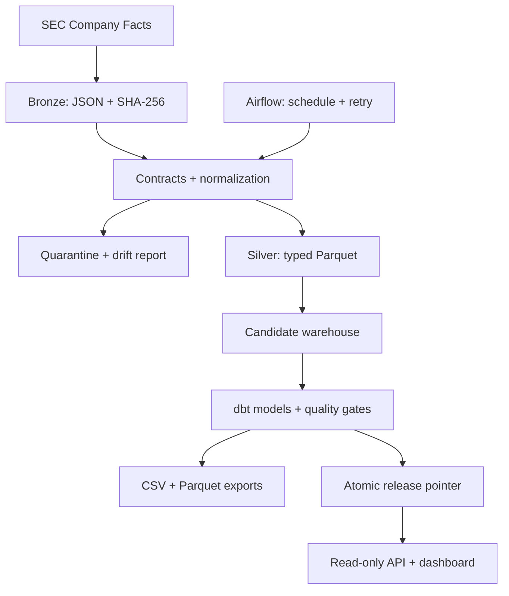

# Architecture and engineering decisions

## Problem

A financial metric is not just a company, year, and number. It has a taxonomy
concept, unit, economic period, filing accession, filing date, and observation
time. A later filing can change an earlier year's reported revenue. A pipeline
that overwrites the old number silently makes historical analysis misleading.
CreditLake retains the evidence and makes selection rules explicit.

## Data flow

1. Fetch a full issuer Company Facts response, or verify and decompress a bundled real response.
2. Hash the source and construct a checkpoint from CIK, configured metadata, normalizer version, and acquisition year range.
3. Store the exact response as a content-addressed compressed bronze file.
4. Map documented US-GAAP concepts to ten USD financial metrics; retain every filing/value version.
5. Persist rejected observations and additive schema telemetry. Stop if more than 0.5% of supported observations are rejected.
6. Write explicit DuckDB types to ZSTD Parquet and insert unseen fact IDs into the candidate's raw tables.
7. Apply SCD Type 2 attribute changes in the same per-snapshot transaction as the facts and checkpoint.
8. Close and checkpoint the candidate before giving it to dbt. Its working WAL files remain in a temporary local directory; only a closed database is copied into the release directory.
9. Build six dbt models and run all 23 dbt tests. Check revenue/assets coverage per configured issuer and record completeness/balance warnings.
10. Export marts, checkpoint and close the warehouse, independently verify its release copy, then atomically replace `latest.json`.

## Warehouse grain

| Relation | Grain | Role |
|---|---|---|
| `raw.facts` | Concept × unit × period × accession × filed date × reported value × issuer | Immutable observed fact versions |
| `raw.issuer_history` | Issuer attribute version | SCD2 history with half-open application-time intervals |
| `ops.snapshots` | Content and normalization checkpoint | Accepted, rejected, inserted counts and source lineage |
| `stg_annual_candidates` | Eligible original fact version | Full-year durations and annual-form instants at the cutoff |
| `stg_canonical_facts` | Issuer × metric × period end | Latest eligible evidence under the selection contract |
| `dim_issuer` | Current issuer | Current presentation metadata |
| `fct_annual_financials` | Issuer × actual annual fiscal period end | Wide facts and financial ratios |
| `mart_company_trends` | Issuer × annual fiscal period end | YoY comparisons and descriptive review flags |
| `mart_filing_revisions` | Changed monetary fact version | Revised/reclassified comparative reporting evidence |

The star schema links financials to the current issuer dimension. Metadata
history remains independently queryable in `raw.issuer_history`. A financial
cutoff does not imply that the company name shown is historical metadata.

## Decision: DuckDB and Parquet

The annual dataset fits a single-machine analytical workload. Local Parquet
and DuckDB provide columnar storage, exact monetary types, and transactional
loading without a separate warehouse service. DuckDB directly reads/writes
[Parquet](https://duckdb.org/docs/current/data/parquet/overview) and supports
[transactions](https://duckdb.org/docs/current/sql/statements/transactions).
The official [dbt DuckDB adapter](https://github.com/duckdb/dbt-duckdb) supplies
SQL model dependencies and test artifacts.

DuckDB is a single-node analytical engine. This project serializes writers;
it does not represent a horizontally scaled warehouse.

## Decision: isolated releases instead of mutating the serving database

dbt builds several relations separately. If its fifth model fails, earlier
models may already have committed. CreditLake builds in a copied candidate
database and serves only closed, validated releases. The old database remains
available while the new build runs. Readers resolve one immutable database
path per request, so the API never queries a half-built model set.

The serving commit is one atomic file replacement on the same local filesystem.
Checkpoints are inside the release database, so a failed build cannot claim
that unfinished data has been processed. Bronze and uncommitted silver files
can survive a failure; replay safely reconstructs the candidate.

The API includes a release ID in data responses. The dashboard checks these
IDs before combining separate requests. If a release changes between them,
it asks the reader to apply the cutoff again.

## Decision: retain versions; rebuild compact marts

Raw ingestion is incremental. Unchanged source/contract checkpoints are skipped,
and repeated fact IDs do not insert twice. The acquisition endpoint still
returns a full issuer response; this is not a CDC transport.

dbt marts are rebuilt after a source or model change. At the bundled data size,
this is fast and makes revised historical periods deterministic. Incremental
mart logic would need to invalidate every affected prior period, and could
silently miss a comparative change. The project's full rebuild deliberately
trades extra small-scale compute for simpler correctness.

## Decision: separate two notions of time

- `filed`: the date reported by the SEC source, used for filing-date cutoffs.
- `first_observed`: when CreditLake first inserted that specific fact version.

The API accepts both `as_of` and `observed_before`. A historical filing learned
today can pass an old filing-date cutoff, yet fail a platform observation-time
cutoff from yesterday. The tests demonstrate this distinction.

These are date-level SEC availability and local observation semantics. They do
not reconstruct exact EDGAR acceptance timestamps or prove that today's source
responses match the response a researcher actually received years ago.

## Airflow and scaling path

The Airflow DAG runs the CLI in an isolated interpreter, then independently
checks the serving release. `max_active_runs=1`, task retries, timeouts, and a
host-level file lock keep execution safe. The default fixture mode is offline;
live mode requires a contact User-Agent.

A larger deployment would keep the metric contracts and fact grain, but move
immutable objects to S3, checkpoints/publication to a transactional catalog,
and dbt models to Snowflake or another shared warehouse. Object-store publication
needs conditional writes and a catalog transaction; local `os.replace` must not
be presented as an S3 commit protocol. Partitioned fact loading and affected-period
mart recomputation would follow from measured scale requirements.
